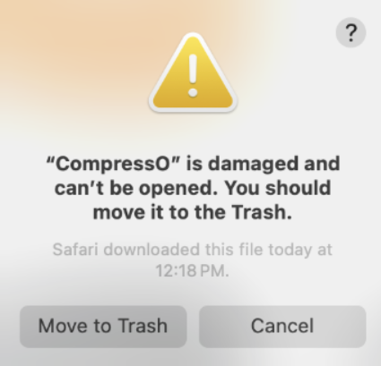
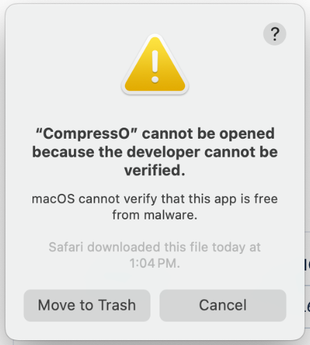
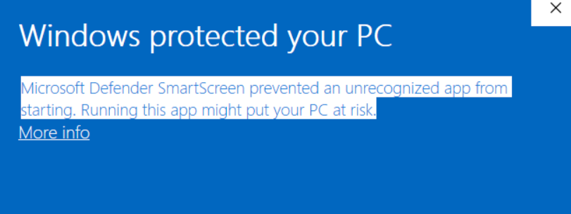

<div align="center">
  <div align="center">
   
  </div>
	<h1 align="center">CompressO</h1>
	<p align="center">
		Compress any video into a tiny size.
    </p>
    <i align="center">
		CompressO is a free and open-sourced cross-platform video compression app powered by FFmpeg.
    </i>
    <br />
    <p align="center">
		Available for <strong>Linux</strong>, <strong>Windows</strong> & <strong>MacOS</strong>.
    </p>
    <p>
      <strong>Download 📦</strong>
    </p>
    <div>
      <a href="https://github.com/codeforreal1/compressO/releases">
        
      </a>
      <a href="https://github.com/codeforreal1/compressO/releases">
        
      </a>
      <a href="https://github.com/codeforreal1/compressO/releases">
        
      </a>
    </div>
    <br />
</div>
<div align="center">
    
</div>

### Tech ⌨

This app is created using [Tauri](https://tauri.app/), a Rust🦀 framework for building a cross-platform desktop app. It uses [Next.js](https://nextjs.org/) as a frontend layer. The compression is done entirely by [FFmpeg](https://ffmpeg.org/) using platform specific standalone binaries.
The app works completely offline and no any network requests is made to/from the app.

### FAQs ❓

1.  <strong> MacOS: "CompressO" is damaged and can't be opened. You should move it to trash. </strong>
    
    <p>
    This error is shown by Apple to gatekeep app developers from using their apps unless it's signed by Apple after paying $100/year fee. The message is completely misleading since the app is not damaged at all. Since this is a free app, I'm not going to go Apple's route just to appease them to make people trust my app. Here's a simple solution for this issue. Open your terminal and run the command:
    </p>

        ```
        xattr -cr /Applications/CompressO.app
        ```

      <p>
           If you don't feel comfortable applying the above solution, you can simply move the app to trash (which also means you cannot use CompressO on your Mac).
        </p>

2.  <strong> MacOS: "CompressO" cannot be opened because developer cannot be verified. </strong>

    

      <p>
        This error is same as the one above on FAQ 1. It's just, Apple made the message different to scare the end user. Please have a look at the solution above.
          </p>

    <br />

3.  <strong>Windows: Microsoft Defender SmartScreen prevented an unrecognized app from starting. Running this app might put your PC at risk.</strong>
    

    This is because you downloaded the windows installer from outside source and Windows Defender is warning you before installation. You can simply click on "More Info" and proceed with the installation.

### License 🚨

<a href="./LICENSE">AGPL 3.0 License</a>

<p className="block text-sm">
This software uses libraries from the FFmpeg project under the LGPLv2.1.
</p>
